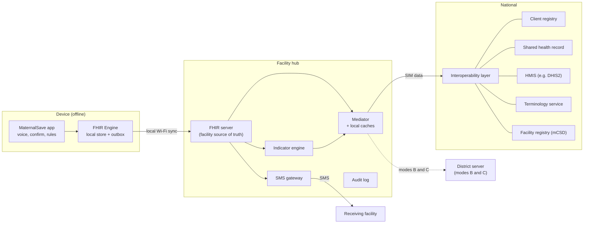
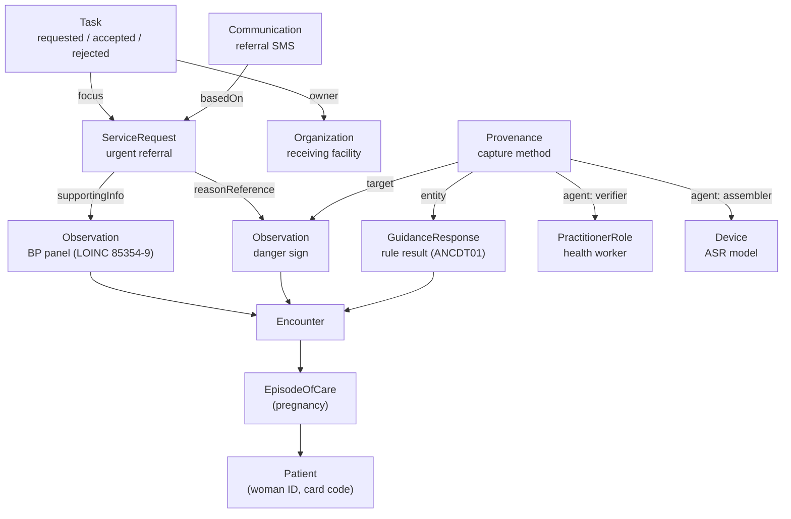
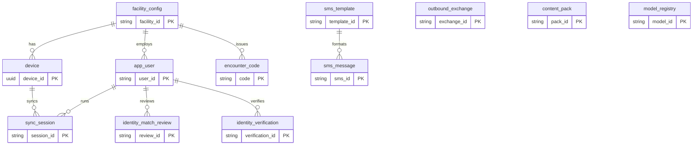

# MaternalSave — Backend Architecture

Architecture specification, version 0.1 (draft)

3 October 2026 · Abdulrahim Jalloh

> Exported from the team's working document. Figures redrawn as Mermaid diagrams for GitHub. For what the hackathon prototype implements today, see the [main README](../../README.md#what-works-now-all-offline).

## 1. Introduction

### 1.1 Purpose

This document specifies the backend architecture of MaternalSave: the components that store, process and exchange clinical data, the standards they implement, and the data model they share. It is the reference for engineering, integration partners and reviewers assessing interoperability.

### 1.2 Scope

In scope: on-device data storage and decision support, the facility hub, integration with national health information systems, the clinical data model, identity, synchronisation, SMS messaging, security, audit and AI provenance.

Out of scope: speech recognition model design, user interface design, and clinical content authoring. These are specified in the MaternalSave PRD.

### 1.3 Requirement keywords

The keywords MUST, SHOULD and MAY indicate mandatory, recommended and optional requirements respectively.

### 1.4 Definitions

| Term | Definition |
| --- | --- |
| FHIR | HL7 Fast Healthcare Interoperability Resources. A standard that defines health data as typed records called resources (Patient, Observation, ServiceRequest and others), a common JSON format for them, and a REST API for reading and writing them. This architecture uses FHIR R4 (4.0.1). |
| Resource | A single FHIR record, such as one blood pressure reading (Observation) or one referral (ServiceRequest). |
| Profile | A set of constraints on a resource for a specific use, published in an implementation guide. |
| Implementation guide (IG) | A published package of profiles, code systems, rules and examples for a domain. |
| FHIR server | A server application that stores resources and responds to FHIR API requests from other systems, for example a search for all observations of one patient. Runs on the facility hub. |
| FHIR Engine | The on-device storage and synchronisation library of the Android FHIR SDK. It stores resources in a local database on the phone and synchronises them with a FHIR server. It does not answer requests from other systems. |
| DAK | WHO Digital Adaptation Kit for Antenatal Care: the software-neutral specification of ANC data elements, workflows, decision logic, indicators and requirements. |
| SMART ANC | WHO's computable FHIR implementation guide derived from the DAK. |
| IPS | HL7 International Patient Summary: a standard FHIR document summarising a patient's health information. |
| OpenHIE | An open reference architecture for national health information exchanges. |
| Hub | Facility hub. The server installed at each health facility (Raspberry Pi with SIM), described in section 6.2. Each facility has its own hub; community health workers synchronise with the hub of the facility that supervises them. |
| Mediator | The hub component that translates and routes messages between MaternalSave and external systems. |
| District server | An MaternalSave FHIR server shared by all facility hubs in a district. It holds the shared pregnancy record where no national shared health record exists (section 6.4). |
| Woman-held record | The ANC card carried by the woman, with a readable summary and a signed QR code (section 10.4). |
| Deployment mode | The configuration matching the health information infrastructure available in a country or district: A, B or C (section 3.3). |

## 2. Architectural principles

| ID | Principle | Basis |
| --- | --- | --- |
| AP-01 | All clinical data MUST be stored as FHIR R4 resources from the point of confirmation. No proprietary intermediate schema is used. | SMART ANC IG; DAK Annex 2 |
| AP-02 | Every coded element MUST carry its DAK code and SHOULD carry mapped standard codes. | DAK scenario 4 |
| AP-03 | WHO SMART ANC profiles and code systems MUST be reused where they exist. MaternalSave profiles extend them and MUST NOT redefine them. | WHO SMART Guidelines L2 to L4 model |
| AP-04 | All encounter functions MUST operate without network connectivity. | ANC.NFXNREQ.036, 040 |
| AP-05 | Devices MUST NOT connect to national systems directly. All external exchange passes through the hub mediator. | ANC.NFXNREQ.063, 068; OpenHIE |
| AP-06 | Care MUST NOT depend on a national identifier. Identifiers are linked when available. | DAK workflow ANC.A; IHE PIXm, PDQm, PMIR |
| AP-07 | Confirmed clinical resources MUST NOT be overwritten. Corrections create new versions or new resources. | FHIR versioning and status |
| AP-08 | Every write MUST be attributable to a user, device, model version, rule and content version. | FHIR Provenance, AuditEvent |
| AP-09 | Each channel MUST carry only the minimum data needed by its recipient. | ANC.NFXNREQ.001 to 007 |
| AP-10 | Country-specific integration MUST be isolated in mediator adapters. | OpenHIE interoperability layer |

## 3. System overview

### 3.1 Tiers

The system has three tiers. Data moves only between adjacent tiers.

| Tier | Role | Connectivity |
| --- | --- | --- |
| Device | Captures, confirms, evaluates and stores encounter data | None required |
| Facility hub | Stores facility records, serves device sync, sends SMS, mediates external exchange | Local Wi-Fi to devices; SIM data and SMS outward |
| National | Registries, shared health record, HMIS and programme registers | Reached by the hub when SIM data is available |
| District (modes B and C) | MaternalSave district server: shared pregnancy record and patient index across facility hubs when no national shared record exists | Reached by facility hubs over SIM data |


*Figure 1. System overview. Data moves only between adjacent tiers. Every hub component writes to the audit log.*

Within each facility hub, the FHIR server is the single source of that facility's data. It feeds the mediator (records to forward upstream), the SMS gateway (referral notices) and the indicator engine (monthly measures, which are forwarded through the mediator). The mediator populates the local caches from national registries and terminology services. Every component writes to the audit log.

At national level, the mediator connects to the country's interoperability layer, which routes each exchange to the relevant registry or service. Where a country has no interoperability layer, the mediator connects to each service directly using the same profiles. Programme registers without a FHIR interface are reached through a mediator adapter.

### 3.2 Encounter data flow

The device processes an encounter in a fixed sequence. Each step completes before the next begins.

1. **Voice capture.** Speech recognition transcribes the worker's account; extraction proposes structured fields; the AI safety net proposes additional danger-sign flags.
2. **Confirmation.** The application reads back each proposed field. The worker confirms, corrects by voice, or enters the value by keypad. Unconfirmed proposals are discarded.
3. **Rules.** The SMART ANC decision logic (CQL) is evaluated on the confirmed data and returns any required action, such as an urgent referral.
4. **Storage.** The FHIR Engine writes the confirmed resources, the rule result and their provenance to the local database in one transaction.
5. **Outbox.** The FHIR Engine queues the new resources for synchronisation. When the hub is reachable, it uploads them.
6. **Hub processing.** The hub stores the resources, sends any referral SMS, and the mediator forwards them to national systems when SIM data is available.

### 3.3 Deployment modes

MaternalSave MUST operate in three deployment modes. The mode is set per country or district by mediator configuration; devices and facility hubs behave identically in all three.

| Mode | Infrastructure available | Source of a woman's history at a new facility | Upstream exchange |
| --- | --- | --- | --- |
| A. National HIE | Interoperability layer with client registry and shared health record | National shared health record | Through the national interoperability layer (Figure 1) |
| B. National systems without HIE | Some national systems, such as an HMIS or a programme register, but no shared health record | MaternalSave district server; woman-held record | District server for clinical records; point-to-point mediator adapters for each national system |
| C. No national systems | None, or paper registers only | MaternalSave district server; woman-held record | District server; indicators exported as reports |

In modes B and C the district server takes the place of the national shared health record. In every mode, the facility hub and the woman-held record keep care possible when no upstream connection is available.

Because all records are FHIR resources, a district can move from mode C or B to mode A when a national HIE becomes available: the mediator submits the district server's records to the shared health record, with no data conversion.

## 4. Standards profile

The following standards apply. IHE profiles are those listed in the [OpenHIE standards and profiles](https://guides.ohie.org/arch-spec/architecture-specification/standards-and-profiles.md).

| Concern | Standard or profile | Applies to |
| --- | --- | --- |
| Clinical data model | HL7 FHIR R4 (4.0.1); [WHO SMART ANC](http://build.fhir.org/ig/WorldHealthOrganization/smart-anc/) profiles | All tiers |
| Decision logic | FHIR PlanDefinition with CQL libraries (CPG-on-FHIR) | Device, hub |
| Data capture | FHIR Questionnaire; Structured Data Capture | Device |
| Clinical summary | HL7 International Patient Summary (IPS) | Hub to receiving systems |
| Referral workflow | FHIR ServiceRequest and Task | All tiers |
| Patient identity | IHE PIXm, PDQm, PMIR | Hub to client registry |
| Facilities and health workers | IHE mCSD | Hub to registries |
| Terminology | FHIR CodeSystem, ValueSet, ConceptMap; IHE SVCM | Hub to terminology service |
| Aggregate reporting | FHIR Measure and MeasureReport; IHE ADX, mADX | Hub to HMIS |
| Document sharing | IHE MHD | Hub to document registry, optional |
| Transport security | TLS | All network links |
| Authorisation | OAuth 2.0 with SMART on FHIR scopes; IHE IUA | Hub API, national links |
| Audit | FHIR AuditEvent; IHE ATNA, BALP; IHE CT for time | Hub, national links |
| Consent | FHIR Consent | All tiers |

## 5. Clinical content foundation

### 5.1 WHO Digital Adaptation Kit

The [DAK](https://www.who.int/publications/i/item/9789240020306) defines the content of an ANC system independently of software. It provides semantic interoperability: an agreed meaning for each data element. It does not define transport, APIs or system architecture.

| DAK content | Use in this architecture |
| --- | --- |
| Data dictionary (Web Annex A): element IDs, FHIR-aligned data types, terminology mappings | Basis of the resource model (section 7) |
| Decision-support tables ANC.DT.01 to DT.38 (Web Annex B) | Rules evaluated on device (section 6.1) |
| Indicators ANC.IND.1 to 13 (Web Annex C) | Aggregate reporting from the hub (section 6.2) |
| Registration workflow ANC.A | Identity management (section 9) |
| Non-functional requirements ANC.NFXNREQ.001 to 069 | Security, sync and interoperability requirements (sections 10, 11) |

### 5.2 WHO SMART ANC implementation guide

The [SMART ANC IG](http://build.fhir.org/ig/WorldHealthOrganization/smart-anc/artifacts.html) is the computable (level 3) form of the DAK. Version 0.3.0 is a FHIR R4 continuous-integration build. It contains:

- profiles for Patient, Encounter, EpisodeOfCare, Observation, Condition, ServiceRequest, MedicationRequest, CarePlan, Immunization, Procedure and supporting resources, including "not done" variants;
- PlanDefinitions ANC.DT.01 to DT.38 with CQL libraries, canonical base `http://fhir.org/guides/who/anc-cds/`;
- Questionnaires for registration (ANC.A), contact steps (ANC.B4 to B12) and referral (ANC.C);
- Measures ANC.IND.01 to 13;
- code systems and value sets, including danger signs and referral reasons, with mappings to SNOMED CT, LOINC and ICD.

MaternalSave MUST pin one SMART ANC version and record it in every content pack. Upgrades are tested against section 14 before release.

### 5.3 Content not covered by WHO artefacts

| Area | Source |
| --- | --- |
| Labour observations and alerts | WHO Labour Care Guide; MaternalSave labour profiles |
| CHW-specific data | National CHW protocol; MaternalSave profiles |
| AI provenance | MaternalSave profile (section 12) |
| SMS messaging | MaternalSave profiles on Communication and Task (section 10.3) |

## 6. Component specification

### 6.1 Device application

The device application is an Android application built on the [Android FHIR SDK](https://developers.google.com/open-health-stack/android-fhir) (Open Health Stack, FHIR R4). The SDK provides storage, forms, decision support and content management; MaternalSave provides the voice and confirmation layers.

| Component | Responsibility | Implementation |
| --- | --- | --- |
| Voice capture | Speech recognition, field extraction, AI safety-net flags | MaternalSave; on-device models |
| Confirmation | Read-back, voice or keypad correction, discard of unconfirmed proposals | MaternalSave |
| Forms | Render DAK Questionnaires; extract resources from answers | SDK Structured Data Capture library |
| Rules | Evaluate SMART ANC PlanDefinitions and CQL on confirmed data | SDK Workflow library |
| Content manager | Install and version the SMART ANC content pack and national adaptations | SDK Knowledge Manager library |
| Local store and sync | Store resources in an on-device database; queue and upload changes; download updates | SDK FHIR Engine library |
| SMS sender | Send the referral SMS directly when the hub is unreachable | MaternalSave; Android SMS API |

The device application has the following requirements.

- DEV-01. The FHIR Engine MUST receive only confirmed resources.
- DEV-02. The local database MUST be encrypted at rest.
- DEV-03. Unconfirmed drafts and audio MUST be held outside the FHIR Engine and deleted when the encounter closes.
- DEV-04. The application MUST display the number of unsynchronised records (ANC.NFXNREQ.041).
- DEV-05. All encounter functions MUST work with no network connection.

The FHIR Engine is used because it already implements offline storage, change tracking and synchronisation against a FHIR server. [OpenSRP 2](https://docs.opensrp.io/engineering/app) runs a WHO SMART-aligned, offline application on the same SDK with a HAPI FHIR server. A custom store would have to reimplement these functions. The constraint is platform: the SDK is Android-only, so the device application is Android-only.

### 6.2 Facility hub

The hub is a Raspberry Pi 5 (8 GB) with a 4G/2G modem and SIM, on backup power.

| Component | Responsibility | Interface |
| --- | --- | --- |
| FHIR server | Store facility records; serve device synchronisation | FHIR R4 REST API over local Wi-Fi |
| Mediator | Translate and route exchanges with national systems; queue and retry | FHIR R4, IHE profiles over SIM data |
| SMS gateway | Send referral notices; receive acknowledgements and coded reports | GSM modem |
| Local caches | Hold code systems, value sets, concept maps, facilities and practitioners | FHIR terminology resources; IHE mCSD |
| Indicator engine | Compute ANC.IND measures | FHIR Measure, MeasureReport |
| Audit log | Record all access and exchange | FHIR AuditEvent |

The FHIR server MUST be selected by load test on the target hardware. Candidates in order of preference:

1. [HAPI FHIR](https://hapifhir.io/) JPA server with PostgreSQL. HAPI publishes no minimum hardware requirement; suitability depends on load, data volume and Java memory settings.
2. A minimal server storing FHIR JSON in PostgreSQL or SQLite, implementing only the operations MaternalSave uses, validated against the same profiles.

The test load is one year of simulated records for a busy facility, with the mediator and SMS gateway running. Because the hub exposes a standard FHIR API, the server implementation can change without affecting devices or national systems.

### 6.3 National integration

The mediator integrates with OpenHIE component roles, not named products. Each role is optional; the fallback applies where a country does not provide it.

| Component | Exchange | Profile | Fallback |
| --- | --- | --- | --- |
| Client registry | Patient search, identifier cross-reference, registration | PDQm, PIXm, PMIR | Local identities on the hub |
| Facility and health worker registries | Facilities, services, practitioners | mCSD | Locally maintained directory |
| Terminology service | Code systems, value sets, concept maps | SVCM | Content-pack terminology |
| Shared health record | Confirmed encounters, observations, referrals; IPS summaries | FHIR R4 transactions; IPS; MHD optional | Hub is the facility record |
| HMIS | Monthly indicators | ADX or mADX; MeasureReport | On-hub reports |
| Programme registers | Programme-specific records | Mediator adapter to the register's API | Not exchanged |

[DHIS2](https://dhis2.org/integration/fhir/) treats FHIR as an interoperability standard rather than its internal model and integrates through transformation middleware. Indicators are therefore sent to DHIS2 as aggregate values through the mediator, not as individual records.

### 6.4 District server

The district server provides a shared pregnancy record across the facilities of a district in deployment modes B and C. It runs the same FHIR server software as the facility hub, hosted at the district health office, a ministry data centre or a government cloud.

| Component | Responsibility | Interface |
| --- | --- | --- |
| Shared record | Receives confirmed resources from every facility hub in the district; returns a woman's history to any of them | FHIR R4 REST |
| Patient index | Links a woman's identities across facilities; queues candidate duplicates for review | IHE PDQm, PIXm |
| Facility directory | Authoritative list of district facilities, services and referral contacts | IHE mCSD |
| Indicator aggregation | Combines facility MeasureReports into district reports | FHIR MeasureReport; ADX export |
| Content distribution | Publishes content packs and model updates to facility hubs | FHIR Library and Bundle downloads |

- DS-01. Facility hubs MUST address the district server with the same profiles used for a national shared health record, so that changing mode is a configuration change.
- DS-02. Facility hubs MUST continue all operations when the district server is unreachable.
- DS-03. The district server SHOULD expose standard profiles (PDQm, PIXm, mCSD) so that it can be absorbed into a future national HIE as a client registry and shared record.

## 7. Data architecture

### 7.1 Resource model

MaternalSave profiles are published in an MaternalSave implementation guide under the canonical base `https://fhir.ovamha.org` (placeholder).

| Concept | Resource | Profile | Key elements |
| --- | --- | --- | --- |
| Woman | Patient | SMART ANC Patient | identifier (multiple, each with a system URI), name, birthDate, telecom |
| Pregnancy | EpisodeOfCare | SMART ANC EpisodeOfCare | patient, period, status |
| Contact or assessment | Encounter | SMART ANC Encounter | episodeOfCare, period, location, participant |
| Vitals, LMP, gestational age, danger signs | Observation | SMART ANC Observation | code (DAK code plus standard codes), value\[x\], effective\[x\], performer, encounter |
| Labour observations | Observation | MaternalSave labour profiles | code, value\[x\], effectiveDateTime |
| Item not done or unavailable | Observation | SMART ANC Observation Not Done | code, reason |
| Diagnosis | Condition | SMART ANC Condition | code, evidence, verificationStatus |
| Rule result | GuidanceResponse | MaternalSave | moduleCanonical (PlanDefinition and version), status, outputParameters |
| Referral | ServiceRequest | SMART ANC Service Request | priority, code, reasonReference, supportingInfo, performer |
| Referral status | Task | MaternalSave | focus, status (requested, accepted, rejected, completed), owner |
| Referral SMS | Communication | MaternalSave | basedOn, recipient, payload, sent, received |
| Handover summary | Bundle (document) with Composition | IPS, with a referral section | sections for problems, results, plan of care |
| Care plan, next contact | CarePlan, Appointment | SMART ANC | contact schedule from ANC.S.01 |
| Facility, worker | Organization, Location, Practitioner, PractitionerRole | SMART ANC | sourced through mCSD |
| Consent | Consent | MaternalSave | scope, category, provision |
| Capture and confirmation | Provenance | MaternalSave AI provenance | see section 12 |
| Access log | AuditEvent | IHE BALP | type, agent, entity, outcome |
| Indicators | MeasureReport | SMART ANC Measures | measure, period, group |

### 7.2 Resource relationships


*Figure 2. Resource relationships for one referral.*

All clinical resources also reference the Patient as subject; these references are omitted from Figure 2.

### 7.3 Resource rules

- DM-01. Every resource MUST receive a UUID at creation on the device (ANC.NFXNREQ.037).
- DM-02. `meta.profile` MUST name the profile and version the resource conforms to.
- DM-03. `meta.source` MUST identify the originating device; `meta.tag` MUST record the content-pack version.
- DM-04. Confirmed Observations MUST NOT be updated in place. A correction creates a new Observation and sets the previous one to `amended` or `entered-in-error`.
- DM-05. Narrative text MUST be generated from structured elements.

### 7.4 Terminology binding

| Code system | Bound to |
| --- | --- |
| SMART ANC code systems | Primary code for every ANC data element, danger sign and referral reason |
| LOINC | Vital signs and measurements, e.g. BP panel 85354-9, systolic 8480-6, diastolic 8462-4, LMP 8665-2 |
| ICD-11, and ICD-10 where a national HMIS requires it | Diagnoses and reporting |
| SNOMED CT | Clinical findings and procedures, where SMART ANC provides mappings |
| MaternalSave code system | Capture methods, AI roles, SMS statuses, labour items not covered by WHO |

Mappings are held as FHIR ConceptMaps in the content pack and on the hub. Yoruba, Krio and English display text is held as CodeSystem designations; codes are language-independent.

### 7.5 Women with no prior record

A woman with no retrievable history is the expected case at first contact and the normal case in mode C. MaternalSave builds her longitudinal record from that first contact onward.

- PH-01. Where no history is retrievable, the application MUST create a new Patient and EpisodeOfCare and record history as reported by the woman, such as previous pregnancies, complications and last menstrual period.
- PH-02. Reported history MUST be distinguishable from measured observations. Reported items carry the Patient as performer and a Provenance activity of `reported-by-woman`. The handover lists them separately, matching the concept note's distinction between reported symptoms, measured observations and previous findings.
- PH-03. Findings copied from the woman-held card MUST keep their original date and carry the Provenance activity `transcribed-from-card`.
- PH-04. Questions not answered and measurements not possible MUST be recorded with the SMART ANC Not Done profile and a reason.
- PH-05. Decision logic MUST treat missing history as unknown, never as normal, and MUST prompt for the missing item where a rule depends on it.

## 8. Database design

### 8.1 Storage layers

Data is held in five stores. Clinical data lives only in the two FHIR stores; the other stores hold transient or operational data.

| Store | Location | Engine | Contents | Lifetime |
| --- | --- | --- | --- | --- |
| Encounter workspace | Device | Encrypted SQLite | Transcripts, AI proposals, audio buffer references, confirmation state | Deleted when the encounter closes (DEV-03) |
| Device FHIR store | Device | FHIR Engine (Room on SQLite) | Confirmed FHIR resources and pending local changes | Retained; synchronised to hub |
| Device operational store | Device | SQLite | Installed content pack and models, session state, SMS sent directly by the device | Retained |
| Hub FHIR store | Hub | HAPI FHIR JPA on PostgreSQL | All facility FHIR resources with full version history | Retained per national retention policy |
| Hub operational schema | Hub | PostgreSQL, schema `ovamha_ops` | Devices, users, sync sessions, SMS, exchange queue, content and model registries | Retained; SMS bodies purged after a set period |

### 8.2 Design approach

Clinical data is not stored in one table per clinical concept. Both FHIR stores hold each resource as a JSON document plus search-index tables generated from FHIR search parameters. This is the storage pattern of HAPI FHIR and the Android FHIR SDK. It allows new profiles, data elements and national adaptations without database migrations, and guarantees that stored data and exchanged data have the same structure.

Operational data that is not clinical (devices, users, queues, SMS) is stored in a conventional relational schema. Operational tables reference FHIR resources by logical ID (for example `ServiceRequest/9c1e…`) and never duplicate clinical content.

### 8.3 Device FHIR store

The FHIR Engine manages its own schema. MaternalSave does not alter it.

| Table (Room entity) | Purpose |
| --- | --- |
| ResourceEntity | One row per resource: type, logical ID, version, last updated, serialised JSON |
| StringIndexEntity, TokenIndexEntity, ReferenceIndexEntity, QuantityIndexEntity, UriIndexEntity, DateIndexEntity, DateTimeIndexEntity, NumberIndexEntity, PositionIndexEntity | Search indexes by FHIR search-parameter type |
| LocalChangeEntity | Pending local changes awaiting upload; source of the unsynced count |
| LocalChangeResourceReferenceEntity | References held by pending changes, used to order uploads |

### 8.4 Hub FHIR store

HAPI FHIR JPA manages its own schema ([HAPI schema reference](https://hapifhir.io/hapi-fhir/docs/server_jpa/schema.html)).

| Table | Purpose |
| --- | --- |
| HFJ\_RESOURCE | One row per resource with its current version |
| HFJ\_RES\_VER | One row per resource version; body stored as GZIP-compressed FHIR JSON. Provides the version history required by AP-07 |
| HFJ\_RES\_LINK | Resolved references between resources |
| HFJ\_SPIDX\_STRING, \_TOKEN, \_DATE, \_NUMBER, \_QUANTITY, \_URI | Search indexes by parameter type |

Searches not covered by standard FHIR search parameters (for example, Provenance by capture activity) are added as custom SearchParameter resources, which HAPI indexes automatically.

### 8.5 Hub operational schema


*Figure 3. Hub operational schema (key relationships; full columns in the table below).*

| Table | Columns (key columns in bold) | Purpose |
| --- | --- | --- |
| facility\_config | **facility\_id** (PK), location\_ref, ultrasound\_available, malaria\_endemic, directory\_version, updated\_at | Site configuration (ANC.Config) |
| device | **device\_id** (PK, UUID), facility\_id, model, app\_version, content\_pack\_version, registered\_at, last\_sync\_at, status, public\_key | Registered phones and tablets |
| app\_user | **user\_id** (PK), practitioner\_role\_ref, username, password\_hash, role, facility\_id, status, failed\_attempts, last\_login\_at | Local accounts (ANC.NFXNREQ.024 to 032) |
| sync\_session | **session\_id** (PK), device\_id (FK), user\_id (FK), started\_at, ended\_at, resources\_up, resources\_down, bytes\_up, bytes\_down, status | Sync history and data-usage reporting |
| sms\_template | **template\_id** (PK), purpose, language, version, body\_template, max\_segments, encoding | Approved message templates |
| sms\_message | **sms\_id** (PK), direction, template\_id (FK), phone\_number\_encrypted, encounter\_code, body, communication\_ref, task\_ref, status, created\_at, sent\_at, delivered\_at | SMS queue and log; status mirrored to the FHIR Communication |
| encounter\_code | **code** (PK), patient\_ref, episode\_ref, facility\_id, issued\_at | Short codes written on ANC cards |
| outbound\_exchange | **exchange\_id** (PK), target\_system, operation, resource\_refs, payload\_hash, status, attempts, next\_attempt\_at, last\_error, created\_at, acknowledged\_at | Mediator queue for national exchange |
| identity\_match\_review | **review\_id** (PK), patient\_ref\_a, patient\_ref\_b, match\_score, status, reviewer\_id (FK app\_user), decided\_at, outcome | Manual duplicate resolution |
| content\_pack | **pack\_id** (PK), version, smart\_anc\_version, sha256, installed\_at, status | Installed clinical content |
| model\_registry | **model\_id** (PK), task, language, version, sha256, device\_ref, released\_at | AI models; device\_ref points to the FHIR Device used in Provenance |
| identity\_verification | verification\_id (PK), patient\_ref, id\_system, method (vnin, oidc, document-seen), result, token\_encrypted, verified\_at, verifier\_id (FK app\_user), consent\_ref | National ID verification events and link tokens (section 9.3) |

The operational schema follows these rules.

- DB-01. All timestamps MUST be stored in UTC.
- DB-02. Phone numbers MUST be encrypted at column level.
- DB-03. Operational tables MUST NOT store clinical values. Clinical content is referenced by FHIR logical ID.
- DB-04. Status values MUST be constrained to defined enumerations (for example, outbound\_exchange.status in queued, sent, acknowledged, failed).

### 8.6 Backup and retention

- DB-05. The hub MUST back up both PostgreSQL databases daily to encrypted external storage, and MUST warn when no valid backup exists for a set number of days (ANC.NFXNREQ.042, 043).
- DB-06. Restores MUST be tested before deployment and after each schema upgrade.
- DB-07. Retention periods follow national health-records policy. SMS bodies are purged after a configurable period; the linked Communication resource remains.

## 9. Identity management

### 9.1 Principles

Identity design follows the World Bank [Principles on Identification for Sustainable Development](https://id4d.worldbank.org/principles), in particular universal coverage, robust identity, interoperability and privacy protection by design, and the ID4D analysis of [digital identification for healthcare](https://documents1.worldbank.org/curated/en/595741519657604541/The-Role-of-Digital-Identification-for-Healthcare-The-Emerging-Use-Cases.pdf). That analysis recommends leveraging foundational ID systems rather than building health-specific ones, and warns that "requiring a foundational system to enroll in or access health services may unintentionally exclude the most marginalized groups".

MaternalSave therefore issues its own functional identifier for every woman, so that care never depends on a national ID, and links that identifier to the national foundational ID when one is available and the woman consents.

### 9.2 Identifier scheme

Each pregnant woman is a FHIR Patient. Health workers are app\_user records (section 8.5) linked to PractitionerRole; the two are never mixed.

| Identifier | Issued by | Form | Stored in | Required |
| --- | --- | --- | --- | --- |
| MaternalSave woman ID | Device, at first contact | UUID | Patient.id | Yes |
| MaternalSave card code | Device, at first contact | Short code with check digit, printed or written on the woman-held card | Patient.identifier, system `https://fhir.ovamha.org/id/card` | Yes |
| Facility ANC register number | Facility | Local format | Patient.identifier, facility-specific system | Where used |
| Client registry ID | National client registry, or the district server in modes B and C | Registry format | Patient.identifier, added through PIXm | When available |
| National ID link | National ID authority | Sector token or verification reference; not the raw ID number where a token is available | Patient.identifier of type token, plus an identity\_verification record | Optional, with consent |
| Phone number | The woman | MSISDN | Patient.telecom | Optional; needed for SMS reminders |

### 9.3 Linking to national ID systems

ID4D guidance on [tokenization](https://id4d.worldbank.org/guide/tokenization) recommends that sectoral systems hold tokens rather than the foundational ID number, so that "the same person is represented by different tokens in different databases" and a breach of one database cannot be linked to others. MaternalSave applies this per country.

| Situation | MaternalSave behaviour |
| --- | --- |
| Nigeria | NIMC replaced raw NIN verification with the [Virtual NIN](https://youverify.co/blog/nimc-launches-virtual-nin-vnin) (vNIN): a 16-character token, valid for 72 hours and usable once, generated by the holder for a specific verifier. MaternalSave uses a vNIN only to verify identity at registration, through an authorised verifier, and records the result. Persistent linkage relies on the national client registry or a health-sector token where one is issued. |
| Sierra Leone | NCRA issues the NIN, and Sierra Leone signed to pilot a MOSIP-based digital ID. Where an authentication service using OpenID Connect (such as MOSIP eSignet) is available to the health sector, MaternalSave stores the subject identifier returned to it as the link token. |
| No verification service reachable | MaternalSave records only that an ID document was shown. The raw number is stored only where national policy requires it, encrypted, and is never used as a key. |
| No ID | Care proceeds with the MaternalSave identifiers alone. |

- ID-01. A Patient MUST be created with an MaternalSave woman ID and card code at first contact. No other identifier is required for care.
- ID-02. Every identifier MUST carry a distinct system URI and, where known, its assigning authority.
- ID-03. National ID verification MUST be optional, consented, and recorded in identity\_verification (section 8.5).
- ID-04. MaternalSave MUST NOT use a foundational ID number as a primary key, search key or SMS content.

### 9.4 Matching and deduplication

- ID-05. When connected, the facility hub SHOULD query the client registry (PDQm) and record returned cross-references (PIXm); it MAY register new identities (PMIR) where the country permits. In modes B and C the district server performs this role.
- ID-06. Candidate duplicates MUST be flagged for manual review and MUST NOT be merged automatically. The outcome is recorded with `Patient.link`.
- ID-07. The card code links a woman to a referral at the receiving facility, and to her full record once the hubs have synchronised.

## 10. Synchronisation and messaging

### 10.1 Device to hub

| ID | Requirement | Mechanism |
| --- | --- | --- |
| SY-01 | Confirmed changes MUST be queued locally and uploaded when the hub is reachable | FHIR Engine change tracking and outbox |
| SY-02 | Uploads MUST be atomic and idempotent | FHIR transaction Bundles; conditional create on identifier (`ifNoneExist`) |
| SY-03 | Updates to editable resources MUST use optimistic locking | `If-Match` with the resource version (ETag); mismatches go to review |
| SY-04 | Downloads MUST be incremental and scoped to the facility or catchment | `_lastUpdated` search; compartment or location filters |
| SY-05 | Sync MUST tolerate interrupted connections (ANC.NFXNREQ.069) | Resumable batches; retry with backoff |

### 10.2 Hub to national systems

- SY-06. The mediator MUST queue outbound exchanges and retry with backoff until acknowledged.
- SY-07. Each exchange MUST be logged as an AuditEvent with outcome.
- SY-08. Facility operations MUST NOT wait on national connectivity.

### 10.3 SMS channel

SMS is used when no data connection is available. All messages are generated from confirmed resources by fixed templates.

| Message | Direction | Source or effect |
| --- | --- | --- |
| Referral notice | Hub or device to receiving facility | Generated from the ServiceRequest; logged as Communication |
| Acknowledgement (ACK) | Receiving facility to hub | Sets Task status to `accepted` |
| Rejection (FULL) | Receiving facility to hub | Sets Task status to `rejected` |
| Coded report | Basic phone to hub | Parsed and validated into Observations; malformed messages receive an error reply |
| Appointment reminder | Hub to woman, with consent | Generated from the Appointment and CarePlan; logged as Communication. Content limited to date, facility and danger-sign reminder, in her language |

- SMS-01. Messages MUST carry an encounter code and MUST NOT carry names or sensitive status.
- SMS-02. Every message sent or received MUST be recorded as a Communication with delivery status.

### 10.4 Woman-held record

WHO recommends, for all settings, that "each pregnant woman carries her own case notes during pregnancy to improve continuity, quality of care, and pregnancy experience" (ANC recommendation E.1, [WHO 2016](https://www.who.int/docs/default-source/reproductive-health/maternal-health/anc.pdf?sfvrsn=5e2c740e_2)). MaternalSave uses the woman-held ANC card as a data channel that needs no network at all.

- WH-01. The card MUST carry the encounter code and a readable summary (gestational age, EDD, danger signs and risks found, last vitals, referral status), so it is useful without a device.
- WH-02. The card SHOULD carry a QR code encoding the same summary as a compressed FHIR Bundle, signed with the issuing facility hub's key so that alteration is detectable. WHO's [SMART Verifiable IPS](https://smart.who.int/ips-pilgrimage/) guide is the reference pattern for verifiable patient summaries.
- WH-03. Scanning the QR code on any MaternalSave device MUST import the summary as proposed resources with Provenance activity `imported-from-card`, which the worker confirms before they are stored.
- WH-04. The card MUST be updated at each contact, by reprinting or by a printed label. Facilities without a printer record the encounter code and key values by hand.
- WH-05. Sensitive items MUST be excluded from the card unless national policy requires them.

## 11. Security and audit

The DAK security requirements ANC.NFXNREQ.001 to 032 are adopted in full and implemented as follows.

| ID | Control | Mechanism | DAK reference |
| --- | --- | --- | --- |
| SEC-01 | Encryption at rest | Encrypted database on device and hub; remote wipe for lost devices | 002 |
| SEC-02 | Encryption in transit | TLS on device-to-hub and hub-to-national links | 007 |
| SEC-03 | Authentication | Per-worker credentials; lockout after failed attempts; automatic logout | 001, 005, 006, 013 |
| SEC-04 | Authorisation | Role-based access scoped to facility and catchment; OAuth 2.0 with SMART on FHIR scopes on the hub API | 015, 025, 026 |
| SEC-05 | User management | Accounts administered on the hub; roles assignable per facility | 024 to 032 |
| SEC-06 | Audit | AuditEvent for logins, record access, writes and exchanges (IHE BALP); synchronised clocks (IHE CT) | 016 to 023 |
| SEC-07 | De-identification | Analytics and indicator exports contain no direct identifiers | 004 |
| SEC-08 | Consent | Consent resource per woman for record sharing, audio retention and model improvement; checked before each exchange | 002 |

## 12. AI provenance

Every confirmed clinical resource MUST be accompanied by a Provenance resource recording how it was captured and who confirmed it.

| Element | Content |
| --- | --- |
| target | The Observation, Condition or ServiceRequest described |
| recorded | Time of confirmation |
| agent, type verifier | PractitionerRole of the confirming worker |
| agent, type assembler | Device resource identifying the model, its version and language |
| activity | MaternalSave capture code: `keyed`, `spoken-ai-extracted-confirmed`, `ai-flag-confirmed`, `rule-prompt-confirmed` |
| entity | Content-pack version; for rule-prompted entries, the GuidanceResponse that triggered the question |

- AIP-01. Unconfirmed AI output MUST NOT be persisted and therefore never appears in Provenance.
- AIP-02. Every rule evaluation that produces an action MUST be stored as a GuidanceResponse, so that no rule output can be suppressed without trace.
- AIP-03. Model versions MUST be registered as Device resources so that records can be traced to the model that assisted their capture.

## 13. Reference transaction: urgent referral

In this scenario a CHW records heavy vaginal bleeding at 28 weeks and a blood pressure of 90/60 mmHg. The danger-sign rule (ANC.DT.01) returns an urgent referral, which the CHW confirms. The device uploads the following transaction Bundle to the hub. Values in angle brackets are resolved from the pinned SMART ANC release and DAK Annex A. The example is abridged.

```json
{
  "resourceType": "Bundle",
  "type": "transaction",
  "entry": [
    {
      "fullUrl": "urn:uuid:p-7f1c",
      "resource": {
        "resourceType": "Patient",
        "meta": { "profile": ["<SMART ANC Patient profile URL>"] },
        "identifier": [
          { "system": "https://fhir.ovamha.org/id/device-uuid", "value": "7f1c…" },
          { "system": "<national or programme ID system URI>", "value": "…" }
        ]
      },
      "request": { "method": "POST", "url": "Patient",
                   "ifNoneExist": "identifier=https://fhir.ovamha.org/id/device-uuid|7f1c…" }
    },
    {
      "fullUrl": "urn:uuid:o-bp",
      "resource": {
        "resourceType": "Observation",
        "status": "final",
        "code": { "coding": [{ "system": "http://loinc.org", "code": "85354-9" }] },
        "subject": { "reference": "urn:uuid:p-7f1c" },
        "component": [
          { "code": { "coding": [{ "system": "http://loinc.org", "code": "8480-6" }] },
            "valueQuantity": { "value": 90, "unit": "mmHg", "system": "http://unitsofmeasure.org", "code": "mm[Hg]" } },
          { "code": { "coding": [{ "system": "http://loinc.org", "code": "8462-4" }] },
            "valueQuantity": { "value": 60, "unit": "mmHg", "system": "http://unitsofmeasure.org", "code": "mm[Hg]" } }
        ]
      },
      "request": { "method": "POST", "url": "Observation" }
    },
    {
      "fullUrl": "urn:uuid:o-bleed",
      "resource": {
        "resourceType": "Observation",
        "status": "final",
        "code": { "coding": [{ "system": "<SMART ANC code system URL>", "code": "<danger sign: vaginal bleeding>" }] },
        "valueBoolean": true,
        "subject": { "reference": "urn:uuid:p-7f1c" }
      },
      "request": { "method": "POST", "url": "Observation" }
    },
    {
      "fullUrl": "urn:uuid:g-dt01",
      "resource": {
        "resourceType": "GuidanceResponse",
        "moduleCanonical": "http://fhir.org/guides/who/anc-cds/PlanDefinition/ANCDT01|<pinned version>",
        "status": "success",
        "subject": { "reference": "urn:uuid:p-7f1c" }
      },
      "request": { "method": "POST", "url": "GuidanceResponse" }
    },
    {
      "fullUrl": "urn:uuid:sr-ref",
      "resource": {
        "resourceType": "ServiceRequest",
        "status": "active", "intent": "order", "priority": "urgent",
        "code": { "coding": [{ "system": "<SMART ANC code system URL>", "code": "<referral to hospital>" }] },
        "subject": { "reference": "urn:uuid:p-7f1c" },
        "reasonReference": [{ "reference": "urn:uuid:o-bleed" }],
        "supportingInfo": [{ "reference": "urn:uuid:o-bp" }]
      },
      "request": { "method": "POST", "url": "ServiceRequest" }
    },
    {
      "resource": {
        "resourceType": "Task",
        "status": "requested", "intent": "order",
        "focus": { "reference": "urn:uuid:sr-ref" },
        "owner": { "reference": "Organization/<receiving facility from mCSD>" }
      },
      "request": { "method": "POST", "url": "Task" }
    },
    {
      "resource": {
        "resourceType": "Provenance",
        "target": [{ "reference": "urn:uuid:o-bleed" }],
        "recorded": "2026-10-03T10:42:00Z",
        "activity": { "coding": [{ "system": "https://fhir.ovamha.org/CodeSystem/capture", "code": "spoken-ai-extracted-confirmed" }] },
        "agent": [
          { "type": { "coding": [{ "system": "http://terminology.hl7.org/CodeSystem/provenance-participant-type", "code": "verifier" }] },
            "who": { "reference": "PractitionerRole/<chw>" } },
          { "type": { "coding": [{ "system": "http://terminology.hl7.org/CodeSystem/provenance-participant-type", "code": "assembler" }] },
            "who": { "reference": "Device/<asr-krio-v0.3>" } }
        ],
        "entity": [{ "role": "source", "what": { "reference": "urn:uuid:g-dt01" } }]
      },
      "request": { "method": "POST", "url": "Provenance" }
    }
  ]
}
```

On receipt, the hub stores the resources, generates the referral SMS and records it as a Communication. An ACK reply sets the Task to `accepted`; a FULL reply sets it to `rejected`. When SIM data is available, the mediator forwards the resources and an IPS summary to the national shared health record.

## 14. Conformance and verification

The following checks MUST pass on every release.

| ID | Check | Method | Pass condition |
| --- | --- | --- | --- |
| CV-01 | Profile conformance | HL7 FHIR Validator against SMART ANC and MaternalSave profiles | No errors on any resource the application writes |
| CV-02 | Decision logic | Test cases generated from each extracted DAK decision-table row, run on device and hub | Expected GuidanceResponse for every positive, negative and boundary case |
| CV-03 | Sync robustness | Interrupted uploads, duplicate resends, concurrent edits on two devices | No duplicates, no lost writes, conflicts flagged |
| CV-04 | External exchange | Round trip against a reference stack: HAPI FHIR, a client registry and an mCSD registry in containers, a test DHIS2 instance | Identifiers cross-referenced; referral and IPS accepted; indicators accepted |
| CV-05 | Security and audit | Access attempts across roles; network inspection | TLS on all links; an AuditEvent for every access |

MaternalSave publishes its profiles, code systems, extensions and CapabilityStatements as an implementation guide built with the HL7 IG Publisher, so that integration partners can verify conformance independently.

## 15. Open items and references

### 15.1 Open items

- [ ] Pin a SMART ANC version and confirm which profiles, value sets and decision tables are complete in it
- [ ] Load-test HAPI FHIR with PostgreSQL on the hub hardware (section 6.2)
- [ ] Confirm the FHIR Engine database encryption configuration for the pinned SDK version
- [ ] Define the labour observation profiles, or adopt the FHIR export of the open-source Labour Care Guide app
- [ ] Inventory the OpenHIE components and APIs available in each target country
- [ ] Register the canonical domain for MaternalSave profiles
- [ ] Determine the deployment mode for each target district, and the hosting for district servers in modes B and C
- [ ] Choose the QR payload format and signing scheme for the woman-held record, and test card printing at facility level

### 15.2 References

- [WHO Digital Adaptation Kit for Antenatal Care (2021)](https://www.who.int/publications/i/item/9789240020306)
- [WHO SMART ANC implementation guide](http://build.fhir.org/ig/WorldHealthOrganization/smart-anc/artifacts.html)
- [SMART ANC PlanDefinition ANC.DT.01](http://build.fhir.org/ig/WorldHealthOrganization/smart-anc/PlanDefinition-ANCDT01.html)
- [OpenHIE architecture overview](https://guides.ohie.org/arch-spec/architecture-specification/overview-of-the-architecture.md)
- [OpenHIE standards and profiles](https://guides.ohie.org/arch-spec/architecture-specification/standards-and-profiles.md)
- [Android FHIR SDK](https://developers.google.com/open-health-stack/android-fhir)
- [OpenSRP 2 engineering documentation](https://docs.opensrp.io/engineering/app)
- [HAPI FHIR](https://hapifhir.io/)
- [DHIS2 and FHIR](https://dhis2.org/integration/fhir/)
- [World Bank ID4D, Principles on Identification for Sustainable Development](https://id4d.worldbank.org/principles)
- [World Bank ID4D, Tokenization](https://id4d.worldbank.org/guide/tokenization)
- [World Bank ID4D, The Role of Digital Identification for Healthcare](https://documents1.worldbank.org/curated/en/595741519657604541/The-Role-of-Digital-Identification-for-Healthcare-The-Emerging-Use-Cases.pdf)
- [NIMC Virtual NIN (vNIN)](https://youverify.co/blog/nimc-launches-virtual-nin-vnin)
- [Sierra Leone MOSIP digital ID pilot](https://www.biometricupdate.com/202301/sierra-leone-signs-up-for-national-digital-id-pilot-built-with-mosip)
- [WHO recommendations on antenatal care for a positive pregnancy experience (2016)](https://www.who.int/docs/default-source/reproductive-health/maternal-health/anc.pdf?sfvrsn=5e2c740e_2)
